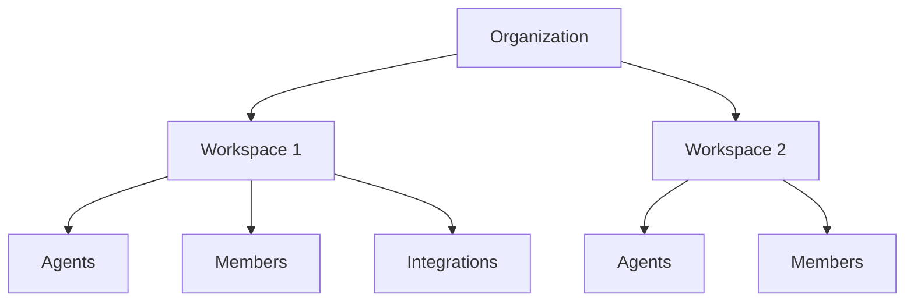

# AutoGPT — 自主 AI 代理

> AutoGPT 是 2023 年最早引起广泛关注的开源自主 AI 代理项目之一。它展示了将 LLM 从"对话模型"升级为"自主行动体"的可能性——给定一个目标，AI 可自主规划、执行、根据反馈调整，直到完成任务。

---

## 工具概述

| 属性 | 详情 |
|------|------|
| **开发者** | Significant Gravitas |
| **首次发布** | 2023 年 3 月 |
| **最新版本** | 2025 年持续迭代 |
| **许可** | MIT |
| **核心语言** | Python |
| **GitHub** | [Significant-Gravitas/AutoGPT](https://github.com/Significant-Gravitas/AutoGPT) |

---

## 核心理念

根据 [AutoGPT 2025 指南 (Medium)](https://medium.com/lets-code-future/what-is-autogpt-a-2025-guide-for-developers-on-autonomous-ai-agents-187870d52603)：

### 自主 AI 代理的四个核心能力

1. **任务分解（Planning）:** 将大目标拆解为可执行的子任务
2. **工具调用（Execution）:** 调用搜索引擎、文件系统、代码执行等工具
3. **记忆管理（Memory）:** 短期（上下文）和长期（向量数据库）记忆
4. **自我反思（Reflection）:** 评估执行结果，调整策略

### 与传统 Chatbot 的区别

| 维度 | Chatbot | AutoGPT |
|------|---------|---------|
| 目标 | 回答单次问题 | 完成复合任务 |
| 执行 | 生成文本 | 调用工具+生成文本 |
| 循环 | 无 | 持续循环直到完成 |
| 记忆 | 多轮对话 | 长期+短期记忆 |
| 自主性 | 被动响应 | 主动行动 |

---

## 架构与工作流

AutoGPT 的经典工作流：

```
用户输入目标
    ↓
Agent 分解任务 → 确定优先级
    ↓
选择下一个行动（思考→行动→观察）
    ↓
调用工具（搜索、写文件、执行代码等）
    ↓
分析观察结果
    ↓
更新记忆（存储关键信息）
    ↓
是否达到目标？→ 否 → 回到"选择行动"
    ↓
是 → 输出最终结果
```

### 支持的工具

- **网络搜索**（Google/Bing）
- **文件读写**
- **Python 代码执行**
- **Web 浏览**
- **图像生成**
- **数据库查询**
- **终端命令**

---

## 2025 年生态演变

Automous AI Agent 领域在 2025 年经历了快速发展：

| 框架 | 定位 | 特点 |
|------|------|------|
| **AutoGPT** | 开源先驱，自主 Agent | 经典自主循环 |
| **LangGraph** | 生产级 Agent 编排 | 更稳健的图结构工作流 |
| **CrewAI** | 多 Agent 协作 | Agent 团队分工协作 |
| **Claude Code** | 编程 Agent | 专为编码优化的 Agent |

---

## 如何开始

### 安装

```bash
# 克隆仓库
git clone https://github.com/Significant-Gravitas/AutoGPT.git
cd AutoGPT

# 安装依赖
pip install -r requirements.txt
```

### 配置

在 `.env` 文件中设置 API 密钥：

```
OPENAI_API_KEY=your-openai-api-key
```

### 运行

```bash
python -m autogpt
# 输入目标后，AutoGPT 开始自主执行
```

---

## 优势与局限

**优势:**
- **自主执行:** 无需人工持续干预
- **灵活的工具集成:** 可扩展的插件系统
- **开源透明:** 完全可见的决策过程
- **教育价值:** 理解 Agent 架构的最佳参考

**局限:**
- **成本不稳定:** 持续调用 API，可能花费不可预测
- **容易陷入循环:** 复杂任务可能反复循环不收敛
- **错误级联:** 早期错误被放大导致最终失败
- **速度慢:** 每个步骤都需要多次 LLM 调用
- **脆弱性:** 提示注入等安全风险

---

## 何时使用 AutoGPT

| 场景 | 推荐程度 | 说明 |
|------|---------|------|
| 简单自动化（文件整理、资料搜集） | ⭐⭐⭐⭐⭐ | 非常适合 |
| 市场调研和工作流自动化 | ⭐⭐⭐⭐ | 效果好，需监督 |
| 代码生成和调试 | ⭐⭐⭐ | 可能陷入循环 |
| 敏感数据处理 | ⭐⭐ | 安全风险需注意 |
| 生产级应用 | ⭐ | 不够稳定，建议 LangGraph |

### 自主 Agent 的演进与反思

AutoGPT 作为先驱验证了"LLM 自主循环"的可行性，但也暴露了第一代自主 Agent 的通病：

| 第一代问题（2023） | 2025-2026 的解法 |
|------|------|
| 容易陷入循环不收敛 | LangGraph 显式状态图 + 步数上限 |
| 成本不可控 | 模型路由、token 预算、缓存 |
| 工具调用脆弱 | 模型原生函数调用 + schema 校验 |
| 长任务记忆丢失 | 检查点持久化 + 外部记忆（向量库） |
| 缺乏可观测性 | LangSmith/Langfuse 全链路追踪 |

> 启示：自主 Agent 从"能跑起来"到"能稳定生产"，核心不是模型变强了，而是工程化（状态管理、护栏、可观测性）成熟了。AutoGPT 的价值在于它最早暴露了这些问题，为后续框架指明了方向。

---

## 2026 年重大演进：AutoGPT Platform

根据 [AutoGPT 官方文档](https://docs.agpt.co/) 和 [GitHub 仓库](https://github.com/Significant-Gravitas/AutoGPT)，AutoGPT 在 2026 年经历了从"单一命令行 Agent"到"完整 Agent 平台"的范式转型。

### 1. AutoGPT Platform 架构

新平台分为两大组件：

| 组件 | 功能 |
|------|------|
| **AutoGPT Server** | 后端运行引擎，包含源码、基础设施和市场（Marketplace） |
| **AutoGPT Frontend** | 可视化界面，含 Agent Builder、工作流管理、部署控制台 |

### 2. 核心新功能

- **Agent Builder（低代码代理构建器）**：通过拖拽 blocks 构建自动化工作流，无需编写代码
- **Blocks 系统**：每个 block 代表一个原子动作（调用外部服务、数据处理、AI 决策等），用户可自定义
- **Marketplace**：预构建 Agent 市场，一键部署常见场景
- **云托管 Beta 版**：加入 waitlist 即可使用，无需自建基础设施
- **一键安装脚本**：`curl -fsSL https://setup.agpt.co/install.sh -o install.sh && bash install.sh`

### 3. 自托管部署

根据 [AutoGPT README](https://github.com/Significant-Gravitas/AutoGPT)：

**系统要求：**
| 资源 | 最低要求 | 推荐 |
|------|---------|------|
| CPU | 4 核 | 8 核+ |
| 内存 | 8 GB | 16 GB |
| 存储 | 10 GB 空闲 | SSD |
| 软件 | Docker 20.10+, Docker Compose 2.0+, Git, Node.js 16+ | — |

**支持的操作系统**：Linux (Ubuntu 20.04+)、macOS (10.15+)、Windows 10/11 (需 WSL2)

### 4. 示例 Agent

AutoGPT README 展示了两个典型场景：

1. **热门话题短视频生成**：读取 Reddit 话题 → 识别趋势 → 自动创建短视频
2. **YouTube 金句提取**：订阅 YouTube 频道 → 新视频发布时自动转录 → AI 识别精彩语录 → 自动发布社交媒体帖子

### 5. AutoGPT Classic vs Platform

| 维度 | AutoGPT Classic（原版） | AutoGPT Platform（新版） |
|------|------------------------|--------------------------|
| 定位 | 命令行自主 Agent | 完整 Agent 开发与部署平台 |
| 界面 | CLI | Web 可视化前端 |
| 构建方式 | 代码 + 配置文件 | 低代码 Block 拖拽 |
| 部署 | 本地 Python 运行 | Docker 容器化 + 云托管可选 |
| 许可 | MIT | Platform 部分 Polyform Shield，其余 MIT |
| 适用场景 | 学习和原型验证 | 生产级自动化工作流 |

此外还有两个独立的 MIT 许可项目：
- **AutoGPT Forge**（`classic/forge`）：Agent 开发框架，用于构建自定义 Agent
- **AutoGPT Benchmark**（`classic/benchmark` / `agbenchmark`）：Agent 性能评测基准

### 6. 支持的模型（2026）

AutoGPT Platform 现在支持主流 LLM 提供商，包括但不限于：

- **Google DeepMind**: Gemini 3、2.5、2.0
- **Anthropic**: Claude Opus、Sonnet、Haiku
- **DeepSeek**: DeepSeek R1、V3
- **Alibaba**: Qwen 3
- **OpenAI**: GPT-5、GPT-4.1、O3
- **Meta**: Llama 4、Llama 3
- **Mistral**: Mistral Large、Medium、Small
- **xAI**: Grok 4、Grok 3
- **Moonshot AI**: Kimi K2
- **Amazon**: Nova Pro、Lite、Micro
- **Microsoft**: Phi-4、WizardLM 2
- **Cohere**: Command A、Command R

### 7. 许可模型更新

| 组件 | 许可 |
|------|------|
| `autogpt_platform/` | Polyform Shield（开发中平台代码） |
| 其余所有（classic、forge、benchmark、frontend 等） | MIT |

> AutoGPT 从"命令行玩具"进化为"可托管的低代码 Agent 平台"，这在 2026 年是一个重要的转折点——它不再只是一个自主循环的演示，而是面向生产环境的完整平台。

---

## 2026年7月最新：v0.6.67–v0.6.69 重大更新

根据 [AutoGPT GitHub Releases](https://github.com/Significant-Gravitas/AutoGPT/releases)，2026 年 7 月 AutoGPT Platform 连续发布了三个重要版本，引入了多项生产级功能。

### 1. Agent-Building Mode（代理构建模式）— v0.6.69 核心功能

**Agent-Building Mode** 是此次更新的最大亮点。它提供了一个防压缩的引导式界面和自动引擎切换，让用户无需理解底层架构就能构建 Agent：

- **引导式创建流程**：通过交互式向导构建 Agent，而非手动编写配置
- **防压缩指南**：构建指南使用特殊标记防止被 LLM 上下文压缩丢失
- **自动引擎切换**：根据 Agent 类型自动选择最合适的执行引擎
- **AutoPilot 简化**：Streamline AutoPilot agent creation（#13579）让创建过程进一步简化

### 2. 组织与工作区（Org/Workspace）— v0.6.67



- **一级组织支持**：Schema、认证、API、数据库迁移、前端界面全面支持
- **组织切换器**：v0.6.69 新增侧边栏组织切换器和 Agent 活动面板
- **多人协作**：同一组织下多成员共享 Agent 和资源

### 3. Slack & Telegram 集成 — v0.6.67 / v0.6.69

AutoGPT 正式支持通过消息平台与 Agent 交互：

| 平台 | 功能 | 版本 |
|------|------|------|
| **Slack** | Webhook + Events API 适配器 | v0.6.67 |
| **Slack** | 主动推送（Proactive Posting） | v0.6.69 |
| **Telegram** | 主动推送（Proactive Posting） | v0.6.69 |
| **DM 投递** | 私信直投 Agent 消息 | v0.6.69 |

这意味着你可以直接在 Slack 或 Telegram 中 @Agent 让它执行任务，Agent 完成任务后主动推送结果。

### 4. Copilot Composer — v0.6.67

**Copilot Composer** 是一个集成化菜单界面，将 Agent 的能力分模块展示：

- **Skills 模块**：管理 Agent 的技能
- **Scheduled 模块**：设置定时任务
- **Integrations 模块**：连接外部服务（Slack、GitHub 等）
- **引导式创建流程**：每个模块提供向导式配置

### 5. Adapter 架构解耦 — v0.6.67

底层架构重大重构：将 Adapter 基类拆分为 **Socket** 和 **Webhook** 两类：

```
旧: Adapter (耦合)
新: SocketAdapter | WebhookAdapter (解耦)
```

这解决了共享核心的耦合问题，让新平台集成（如 Slack Webhook、Telegram Bot）更快更独立。

### 6. 新模型支持一览

| 版本 | 新增模型 |
|------|---------|
| v0.6.69 | GPT-5.6, GPT-5.5, GPT-5.4, o-series |
| v0.6.67 | 各主流 LLM 提供商持续跟进 |

### 7. Multi-Batch 部署 — v0.6.69

Batch-deploy bot 现在支持**多批次部署**，每批次最多 4 个 Agent，支持命名批次管理。这适合需要批量运行多个 Agent 的场景（如同时处理多个客户的工单、批量数据采集等）。

### 演进总结

| 时间 | 里程碑 |
|------|--------|
| 2023 Q1 | AutoGPT Classic：命令行自主 Agent（MIT） |
| 2025 | AutoGPT Platform Beta：Web 前端 + Block 系统 |
| 2026.07 | v0.6.67–0.6.69：Org/Workspace、Slack/Telegram、Agent-Building Mode、多批次部署 |
| 2026+ | 云托管 GA → 完整的企业级 Agent 平台 |

> 📌 关键趋势：AutoGPT 正在从"个人开发者工具"转变为"团队协作的 Agent 平台"。Workspace、Slack 集成、批次部署这些功能明确指向企业场景。

---

**参考资料：**
- [What Is AutoGPT? A 2025 Guide (Medium)](https://medium.com/lets-code-future/what-is-autogpt-a-2025-guide-for-developers-on-autonomous-ai-agents-187870d52603)
- [Building Autonomous AI Agents 2025 Guide (Facebook/Medium)](https://medium.com/@Micheal-Lanham/building-the-future-your-guide-to-autonomous-ai-agents-in-2025-fb690ebc1caa)
- [AutoGPT GitHub](https://github.com/Significant-Gravitas/AutoGPT)
- [AutoGPT 官方文档](https://docs.agpt.co/)
- [AutoGPT Platform — Self-Hosting Guide](https://docs.agpt.co/platform/self-hosting/getting-started)

---

## 2026 最新进展：AutoGPT —— 从"网红项目"到"精神先驱"

### 概述

AutoGPT 在 2023 年以"第一个病毒式自主 AI Agent"的身份横空出世，点燃了整个 Agentic AI 浪潮。进入 2026 年，AutoGPT 不再是聚光灯下的焦点——大部分创新的能量已转移至 Browser Use、Anthropic Computer Use、CrewAI 等新一代工具——但它仍然是自主 Agent 领域的"精神先驱"（spiritual ancestor），社区超过 50,000 Discord 成员，AutoGPT Platform 仍在持续进化。

### 核心要点

#### 1. AutoGPT 的 2026 现状：仍在进化，但不再是中心

根据 renthuman.pro 2026 年 7 月的最新回顾 *AutoGPT — The Original Autonomous AI Agent (2026 Update)* 和 SellerShorts 2026 年 5 月的分析 *AutoGPT in 2026: Status, Alternatives, What Replaced It*：

- **仍然活跃**：开源 Python 应用，现已兼容 GPT-4o、Claude、Gemini 等多家模型（不再只依赖 GPT-4）
- **AutoGPT Platform**：提供自托管（Self-Hosting）和云端版本，集成了 Agent 构建、部署和监控功能
- **社区规模**：50,000+ Discord 成员，持续有开发者 Fork 和实验
- **定位变化**：从"通用自主 Agent"转变为教学和实验平台

#### 2. "后 AutoGPT 时代"的自主 Agent 工具格局

2026 年，曾经由 AutoGPT 开创的"自主 Agent"理念已被新一代工具分化并专业化：

| 方向 | 代表工具 | 与 AutoGPT 的对比 |
|------|---------|------------------|
| **浏览器自动化 Agent** | Browser Use, Skyvern | 更专注、更可靠，解决实际网页操作问题 |
| **桌面操作 Agent** | Anthropic Computer Use | 直接操控操作系统 GUI，理念更激进 |
| **多 Agent 协作框架** | CrewAI, AutoGen, LangGraph | 结构化多角色协作，比单一 AutoGPT 循环更强 |
| **无代码 Agent 构建** | LangSmith Agent Builder, Dify | 自然语言描述需求即可生成 Agent |
| **基础模型原生 SDK** | OpenAI Agents SDK, Claude Agent SDK | 从模型层面直接提供 Agent 能力 |

#### 3. AutoGPT 的核心贡献与历史定位

尽管实用价值已下降，AutoGPT 在 AI 工具发展史中留下了三个里程碑式的贡献（综合 renthuman.pro 和 AI News Desk 2026 分析）：

1. **首次证明"自主 Agent 循环"可行**：给定目标 → 分解任务 → 调用工具 → 自检 → 循环迭代 —— 这套范式至今仍是几乎所有 Agent 框架的核心逻辑
2. **推动"工具调用"成为 LLM 标准能力**：AutoGPT 的成功是 OpenAI 推出 Function Calling 和后来的 Agents SDK 的重要催化剂
3. **开源社区启蒙**：启发了一整代 AI 开发者理解"Agent = LLM + 工具 + 记忆 + 循环"的本质

#### 4. 2026 年是否还值得学 AutoGPT？

综合多方评价：

- **学习 Agent 原理**：✅ 值得。AutoGPT 的代码和架构是理解"自主 Agent 循环"的最佳教学材料
- **生产环境使用**：❌ 不推荐。新一代框架在可靠性、可观测性、生态集成方面全面超越
- **快速构建 Agent**：推荐 LangSmith Agent Builder 或 Dify（无代码），或 CrewAI/LangGraph（代码控制）
- **浏览器自动化**：推荐 Browser Use 或 Skyvern

### 参考来源

- [AutoGPT — The Original Autonomous AI Agent (2026 Update) — renthuman.pro (2026.07.21)](https://renthuman.pro/autogpt-the-original-autonomous-ai-agent-that-started-the-agentic-revolution-2026-update/)
- [AutoGPT in 2026: Status, Alternatives, What Replaced It — SellerShorts (2026.05)](https://sellershorts.com/resources/ai-agent-builder/autogpt)
- [AutoGPT vs BabyAGI vs Jarvis Compared 2026 — AI News Desk](https://ainewsdesk.app/autonomous-ai-agents-2026-autogpt-vs-babyagi-vs-jarvis/)
- [OpenClaw vs AutoGPT (2026) — Blink Blog](https://blink.new/blog/openclaw-vs-autogpt-comparison-2026)

---

## 资料整理状态

> 自动采集只作为后台资料来源，不直接发布搜索结果链接；教程正文需要经过阅读、筛选、归纳后再更新。

<!-- RESOURCES_START -->

- 后台候选资料：4 条，覆盖 4 个来源域名。
- 最近采集日期：2026-07-02。
- 发布规则：候选资料必须先经过阅读、去重、事实核验和中文归纳，再合并进正文；本区块不发布原始搜索结果。

<!-- RESOURCES_END -->

*资源区块更新时间：2026-07-25 00:09:45*
